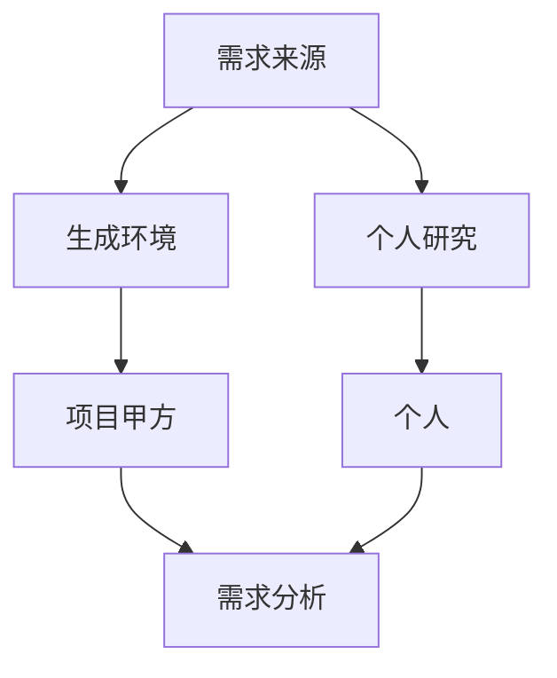

# Machine_Learning_Introduction
机器学习
# 一、机器学习方法论
## 统计学习/机器学习/深度学习/人工智能

>• 统计学习：关于计算机基于数据构建概率统计模型并运用模型对数据进行预测与分析的一门学科。 
• 机器学习：致力于研究如何通过计算的手段，利用经验来改善系统自身的性能。是人工智能的核心技术。 
• 深度学习：机器学习中神经网络算法的延伸，可以理解为包含很多个隐层的神经网络模型。 
• 人工智能：人工智能是利用数字计算机或者数字计算机控制的机器模拟、延伸和扩展人的智能，感知环境、获取知识并使用知识获得最佳结果的理论、方法、技术及应用系统。

## 机器学习的核心任务

| 问题 | 答案 |
| --- | --- |
| 机器学习学什么？ | 学习一个参数得到优化的模型  |
| 学习的对象是什么？ | 数据（结构化数据、文本、语音、视频和图像等）  |
|怎么学？  | 给定一个评价标准，据此根据算法不断迭代训练进行学习  |
| 怎样学效果最好？ | **最大拟合训练集同时具备最好的泛化能力**|

## 机器学习的核心要义
• 给定一组数据，要从数据中最大程度上归纳总结出普遍的规律 
• 学习的不够，普遍规律没有归纳出来，这是**欠拟合**
• 学习能力太强，以至于将数据中的噪声也拟合了，这是**过拟合**
• 但站在上帝视角，模型空间中总存在一个模型，它能够最大程度的拟合训练数据， 且对未知的测试数据有最好的泛化能力。

• 如何斗争？**获取更多的数据 特征工程 正则化 算法调优**

## 机器学习项目实战全流程

>需求分析
>数据采集
>数据清洗耗费70%的时间
>数据分析与可视化
>特征工程
>机器学习建模与调优
>模型结果展示与报告输出

## 机器学习具体学习方法之如何补数学的坑
• 作为一门基础性学科，数学是所有数据科学领域的基石。 
• 常规的三大数学基础课：微积分、线性代数和概率统计 
• 微积分要做到：**极限会算、导数和梯度会求、积分会算**
• 线性代数要做到 **矩阵理论和运算熟悉**
• 概率论要对 **随机变量和常见概率分布熟悉** 
• 统计学方面要对参数估计和假设检验等理论熟悉，熟悉 各种统计量，熟知各种统计图形应用场景。 
• 之后才是更深入的数学分支：凸优化 随机过程 …

## 书籍推荐
#### 统计学习方法
#### 机器学习 西瓜书
#### 机器学习实践
#### DEEP LEARNNING  花书

**学习之初，一定要弄懂每个模型和算法的基本原理，然后在不调用 sklearn的情况下手动写一遍**

## 机器学习具体学习方法之如何实战
* kaggle  数据科学竞赛平台
* 天池 阿里云

# 二、需求分析
## 机器学习项目需求来源 
• 需求来源：需求从哪来？

## 需求分析本质
需求分析：结合**现有条件**将**需求方/业务方的问题**转化为一个**机器学习 可解决的问题**。

>现有条件：
    包括企业或个人当前所具备 的软硬件设备、计算资源、 技术能力以及最重要的是否 有数据。 
   
>需求方/业务方的问题:
甲方/领导/产品经理提出的 问题。需要需求承接者具备 相应的软硬件资源和技术能 力以及一定程度的专业领域 和业务场景知识。

>机器学习 可解决的问题:
>通过对业务的分析和数据分 析找出关键特征，利用机器 学习理论知识构建模型。

## 机器学习技术、产品和应用调研
• 数据科学竞赛层面：有无项目类似的公开竞赛
• 论文层面：国内外（主要是国外）有无项目相关领域和方向的研究论文
• 产品应用层面：国内外是否有项目相关的产品和应用范例

# 三、数据采集与爬虫
[点击前往数据采集与爬虫csdn博客](https://blog.csdn.net/qq_38534107/article/details/89905377)

[点击前往 jupyter notebook 文件](https://github.com/ybsdegit/Machine_Learning_Introduction/blob/master/%E4%B8%89%E6%95%B0%E6%8D%AE%E9%87%87%E9%9B%86%E4%B8%8E%E7%88%AC%E8%99%AB/%E6%95%B0%E6%8D%AE%E9%87%87%E9%9B%86%E4%B8%8E%E7%88%AC%E8%99%AB.ipynb)
